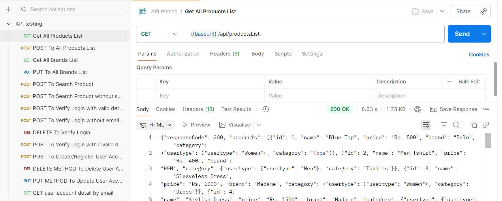

# 🧪 API Testing – E-Commerce User & Product Management  

This project contains **Postman API test cases** for an E-Commerce system, covering authentication, user management, products, and brands.  

## 🛠️ Tools Used  
- **Postman** – For creating and running API test cases  
- **Newman** – (Optional) For running collections via CLI  
- **JSON Schema Validator** – For response validation  

## 📌 Tested Endpoints  

### 🔹 Product & Brand APIs  
- `GET /api/productsList` – Fetch all products  
- `POST /api/productsList` – Add products  
- `GET /api/brandsList` – Fetch all brands  
- `PUT /api/brandsList` – Update brands  
- `POST /api/searchProduct` – Search product by keyword  
- `POST /api/searchProduct` – Search without parameters (negative case)  

### 🔹 Authentication APIs  
- `POST /api/verifyLogin` – Login with valid credentials  
- `POST /api/verifyLogin` – Login without email parameter (negative case)  
- `POST /api/verifyLogin` – Login with invalid details (negative case)  
- `DELETE /api/verifyLogin` – Delete login session  

### 🔹 User Account APIs  
- `POST /api/createAccount` – Register new user  
- `PUT /api/updateAccount` – Update existing user  
- `DELETE /api/deleteAccount` – Delete user account  
- `GET /api/getUserDetailByEmail` – Get user details by email  

## 📸 Screenshots  
  
  

## 📁 Files Included  
- `API testing.postman_collection.json` – Main Postman test collection  

## 🚀 How to Use  
1. Import the collection into **Postman**   
2. Set environment variable `baseurl` with your API base URL  
   - URL : `https://automationexercise.com`  
3. Run APIs using **Collection Runner**  
4. (Optional) Run via CLI using **Newman**:  
   ```sh
   newman run "API testing.postman_collection.json" --env-var baseurl="https://automationexercise.com"

